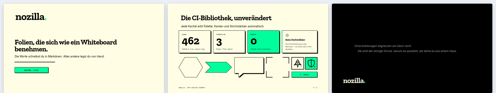
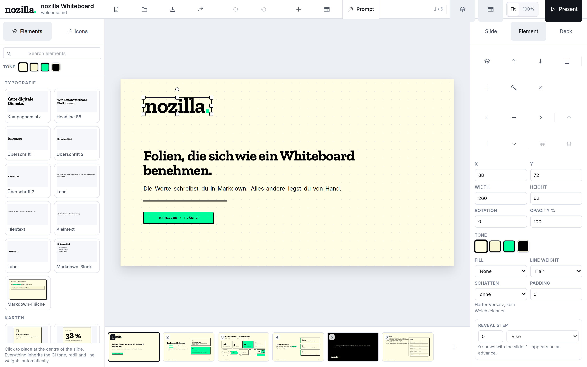
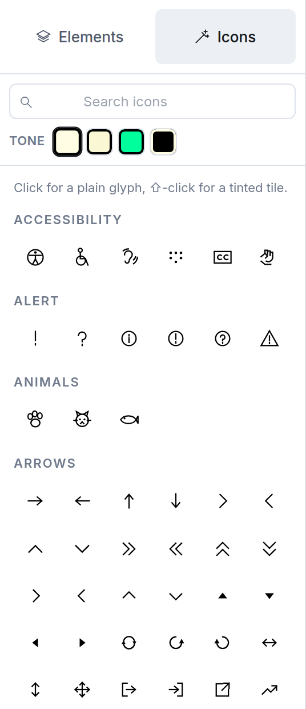
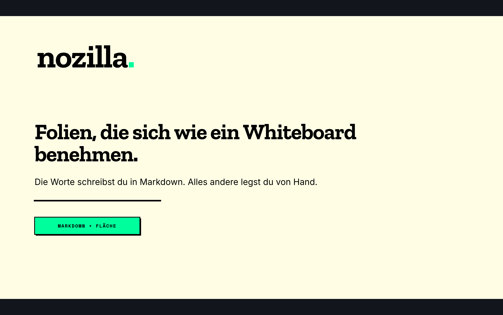
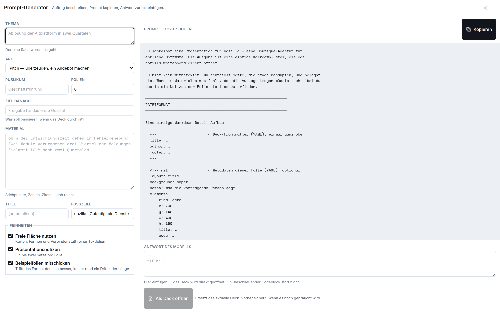

<div align="center">



# nozilla Whiteboard

**Markdown-Präsentation und freie Fläche in einem.**
Es kann nur eines herstellen — Material, das der
[nozilla Corporate Identity](https://github.com/daimpad/nozilla-ci) entspricht.

[](https://github.com/daimpad/nozilla-whiteboard/actions/workflows/ci.yml)
[](https://daimpad.github.io/nozilla-whiteboard/)


[**Ausprobieren**](https://daimpad.github.io/nozilla-whiteboard/) ·
[Dateiformat](#das-dateiformat) ·
[Export](#export) ·
[Architektur](#die-architektur-in-einem-bild) ·
[Prompt-Generator](./PROMPT.md)

</div>

---

Die Worte schreibst du in Markdown. Alles andere legst du von Hand. Am Ende
steht wieder eine `.md` — Inhalt und Positionen in einer Datei.

```bash
npm install
npm run dev      # http://127.0.0.1:5173
```

Kein Server, keine Datenbank, kein Konto. Alles passiert im Browser, alles was
bleibt ist eine Datei auf der Platte.



<sub>Links die Bibliothek, in der Mitte die Fläche, rechts der Inspektor. Die
Oberfläche ist bewusst neutral — die einzige Farbe im Bild sitzt auf der
Folie.</sub>

---

## Die CI ist nicht Stil, sondern Statik

Die Marken-Vorgaben sind hier keine Empfehlung, an die man sich erinnern muss.
Sie sind so eingebaut, dass ein Verstoß gar nicht erst entstehen kann:

| Regel                        | Wie sie erzwungen wird                                                                                                                                                                                                                                         |
| ---------------------------- | -------------------------------------------------------------------------------------------------------------------------------------------------------------------------------------------------------------------------------------------------------------- |
| Radius ist 0                 | Auf der Folie: `RADIUS = 0`, und Formen nehmen keinen Radius-Parameter entgegen. Die Werkzeugleisten dürfen runde Ecken haben — sie sind keine Folie (siehe unten).                                                                                            |
| Schatten sind harte Versätze | Ein Schatten ist eine zweite, versetzte Fläche in Tinte. Es gibt keinen Weichzeichner — auch deshalb exportiert er exakt nach PDF.                                                                                                                             |
| Farbe hat drei Rollen        | Ein Element wählt eine Rolle (`paper`, `white`, `signal`, `ink`), keinen Farbwert — `white` ist das reine Weiß neben dem Creme. **Einen Farbwähler gibt es nicht.**                                                                                                                                                  |
| Keine fremden Icons          | Das Set sind die 554 Icons des CI — 462 Font-Awesome-Nachbauten und 92 Kern-Zeichen —, aus deren Geometrie generiert.                                                                                                                                                                                        |
| Drei Schriften               | Zilla Slab · Inter · Space Mono, selbst gehostet aus dem CI-Repo. Auf dem Bildschirm als WOFF2, im Export eingebettet oder als Umriss — die Marken-Schrift steht in der Datei, nicht nur ihr Name. Labels werden automatisch in Versalien mit 0,12 em gesetzt. |
| Grüner Marker                | `==so==` im Markdown. Auf der Fläche, in SVG und PDF dieselbe Fläche unter dem Wort; in PPTX eine Texthervorhebung, damit er beim Umbruch am Wort bleibt.                                                                                                      |

Die Standard-Tailwind-Palette ist **ersetzt**, nicht erweitert: ein
versehentliches `bg-blue-500` ist ein sichtbarer Fehler und kein stiller
CI-Bruch.

### Die Marke gehört auf die Folie, nicht in die Leiste

Ein Werkzeug, das cremefarbene Folien baut, darf selbst nicht cremefarben sein
— sonst sieht man nicht mehr, wo die Folie anfängt. `theme.config.ts` führt
deshalb zwei getrennte Sätze:

|              | Namensraum                                                                                               | Wofür                                                                                                                              |
| ------------ | -------------------------------------------------------------------------------------------------------- | ---------------------------------------------------------------------------------------------------------------------------------- |
| **Inhalt**   | `palette`, `color`, `elementTones` → `bg-signal`, `text-ink`, `border-line`, `shadow-md`, `rounded-none` | alles, was auf einer Folie landet und exportiert wird. Papier, Tinte, Signal. Radius 0, harte Versatzschatten.                     |
| **Werkzeug** | `ui`, `uiRadius`, `uiShadow` → `bg-ui-surface`, `text-ui-ink`, `border-ui`, `shadow-ui-md`, `rounded-md` | Leisten, Paletten, Felder, Griffe, Auswahlrahmen. Weiß und kühles Grau, kleine Radien, weiche Schatten. Erreicht nie einen Export. |

Die Oberfläche leiht sich **nichts** von der Marke, auch keinen Akzent. Sie
kennt Weiß, sechs Graustufen und Schwarz. Der Knopf, der die Hauptsache ist,
wird dunkel statt bunt — damit die einzige Farbe im Bild die auf der Folie ist.
Auch Auswahlrahmen, Griffe und Hilfslinien laufen in derselben Schwarz-Familie.

`src/theme/theme.test.ts` hält die Linie: er liest die Komponenten-Quellen und
schlägt an, sobald eine Bedienfläche einen Marken-Ton benutzt — oder ein
`ui`-Wert und ein Marken-Wert unbemerkt derselbe werden.

Die Oberfläche gibt es hell und dunkel. Das Zahnrad unten links stellt es ein
(*System*, *Hell*, *Dunkel*); daneben steht, welcher Stand gerade läuft. Die
Einstellung gehört dem Arbeitsplatz, bleibt im Browser und steht in keiner
Datei — **die Folie sieht in beiden Fällen gleich aus**, und ein Export erst
recht.

### Mehr als eine Marke

Die linke Spalte ist wechselbar. Ein **Erscheinungsbild** belegt Farben,
Typo-Leiter, Schriften, Strichstärken, Schattenversätze, die Wortmarke und das
Icon-Set; angelegt wird es in `src/themes/` (eine Datei je Kunde), gewählt im
Inspektor unter *Brand theme*, gemerkt im Frontmatter:

```md
---
title: Ablösung der Altplattform
theme: musterkunde
---
```

Mitgeliefert wird einer: **Musterkunde**, ein erfundenes Haus für Muster und
Proben. Orange statt Grün, Weiß statt Creme, Inter statt Zilla Slab, eine eigene
Wortmarke und zwölf eigene Zeichen. Er ist zum Ansehen da und zum Abschreiben —
eine Kundendatei kopiert ihn und ersetzt die Werte.

Dazu gehört ein **Deck**, das ihm gehört: *Beispiel öffnen → Probenhaus*. Es ist
kein Schaustück, sondern der Beleg — die Willkommensmappe gehört nozilla, und
jeder von Hand gelegte Titel darin ist für *diese* Schrift ausgemessen. Ein Deck
unter fremder Marke zeigt erst, ob die Vorlage trägt.

Damit trägt die `.md` ihre Zugehörigkeit mit — wer sie weitergibt, gibt die
Marke mit. Ein Erscheinungsbild, das hier nicht angemeldet ist, wird nicht
still ersetzt: der Eintrag bleibt stehen, und die Oberfläche sagt, dass sie ihn
nicht kennt. Dasselbe gilt für ein Icon, das im gewählten Set fehlt — statt
eines beliebigen Ersatzes steht dort ein durchgestrichenes Quadrat.

Die rechte Spalte wechselt nie mit. Auch die Icons der Leisten kommen weiter
aus dem nozilla-Set: das Werkzeug ist nicht das Werkstück.

Was **nicht** wechselt, ist ebenso Absicht: Radius 0, harte Versatzschatten,
1280 × 720, das 64er-Raster der Icons. Das sind keine Geschmacksfragen, sondern
das, wofür dieses Werkzeug gebaut ist — wer runde Ecken zulässt, gibt die
Garantie auf, dass hier nur konformes Material entstehen kann.

---

## Was das Werkzeug kann

### Markdown-Motor

Deck aus einer `.md` laden (Knopf, `⌘O`, oder Datei ins
Fenster ziehen). Folientrenner ist `---`; der Trenner wird in Codeblöcken und
HTML-Kommentaren ignoriert und verwechselt eine Setext-Überschrift nicht mit
einem Folienwechsel. Deck-Frontmatter oben, Folien-Metadaten je Folie in einem
`<!-- nzl … -->`-Block. Überschriften, Listen, Aufgabenlisten, Code, Zitate,
Tabellen, Bilder — gesetzt in der CI-Hierarchie.

### Freie Fläche



Ziehen, größer ziehen, drehen; Mehrfachauswahl per Shift oder
Gummiband. Einrasten auf das 8er-Raster _und_ auf Hilfslinien: Kanten und
Mitten der Nachbarn, Folienränder, Satzspiegel. `Alt` hält das Raster an.
Duplizieren, löschen, stapeln, ausrichten, verteilen, sperren. **Gruppieren**
mit `⌘G`, auflösen mit `⇧⌘G` — ein Klick auf ein Mitglied nimmt die ganze
Gruppe mit, und die Zugehörigkeit steht in der `.md`. Rückgängig und
Wiederholen mit Gesten-Bewusstsein — ein Zug ist ein Schritt, nicht sechzig.

**Eingesetzt wird an einer Linie.** Jeder Baustein aus der Bibliothek beginnt am
linken Satzspiegel und stapelt sich unter das, was dort schon steht. Die Spalte
ist 48 % des Satzspiegels breit, dieselbe Teilung wie im `split`-Layout; ist sie
voll, geht es in die zweite. Fließender Inhalt bekommt die Spaltenbreite und
wird darin neu ausgemessen; was ein eigenes Maß hat — ein Zeichen, ein Bild —
behält es und fängt nur an derselben Kante an.

Der **Fließtext der Folie zählt dabei mit**: eingesetzt wird darunter, nicht
darüber. Nur wenn nirgends Platz bleibt, wird er überdeckt — das ist immer noch
besser, als alles auf einen Notplatz am unteren Rand zu legen, wo eins das
andere verdeckt. Nichts muss hinterher an seinen Platz gezogen werden.

**Die Zwischenablage** trägt beides: ein Bildschirmfoto mit `⌘V` wird ein Bild,
und `⌘C` / `⌘X` nehmen ausgewählte Elemente mit — auf eine andere Folie, in ein
zweites Fenster, in jeden Editor. Was dabei in der Zwischenablage liegt, ist
kein eigenes Format, sondern der `<!-- nzl -->`-Block, der auch in der `.md`
stünde: lesbar, einfügbar, und von denselben Prüfungen gedeckt. Auf einer
anderen Folie behält das Eingefügte seinen Ort — das ist der Sinn der Sache;
nur auf derselben Folie rückt die Kopie beiseite.

### Präsentation

`P` startet, `Esc` beendet, `F` Vollbild, `N` Notizen.
Übergänge und Einblendungen; Elemente tragen einen Schritt, damit eine Folie
Gedanke für Gedanke aufgeht. Übersicht mit `⌘K`, Filmstreifen immer sichtbar.
`prefers-reduced-motion` wird beachtet.

<br clear="right">



### Export

| Format         | Was herauskommt                                                                                               |
| -------------- | ------------------------------------------------------------------------------------------------------------- |
| **Markdown**   | Das Deck samt aller Positionen, wieder ladbar                                                                 |
| **SVG**        | Echte `<path>`/`<text>`-Vektoren — kein `foreignObject`, keine Rasterung                                      |
| **PDF**        | Vektorseiten mit markierbarem, durchsuchbarem Text                                                            |
| **PowerPoint** | `.pptx` mit echten Formen und **bearbeitbaren Textrahmen** — auch der Weg nach Google Slides (dort hochladen) |
| **PNG**        | Eine Folie in 2560 × 1440 — zum Verschicken, wenn niemand eine Datei will                                     |

Für SVG und PDF gibt es zwei Wege, wie die Schrift in die Datei kommt. Beide
erzeugen dasselbe Bild; sie unterscheiden sich darin, was die Gegenseite
können muss:

|                                 | Was passiert                                                                                                                                            | Wofür                                                                                       |
| ------------------------------- | ------------------------------------------------------------------------------------------------------------------------------------------------------- | ------------------------------------------------------------------------------------------- |
| **Schrift einbetten** (Vorgabe) | Die benutzten Schnitte liegen _in_ der Datei — im PDF als eingebettete Teilmenge (nur die vorkommenden Zeichen), im SVG als `@font-face` mit Daten-URI. | Alles, was danach noch gelesen, durchsucht oder redigiert wird.                             |
| **Text in Pfade**               | Jede Glyphe wird zur Kontur. Danach steht in der Datei keine Schriftreferenz mehr.                                                                      | Druckvorstufe, Illustrator, Inkscape — überall, wo eingebettete Schriften ignoriert werden. |

Ein sechsseitiges Deck kostet als PDF mit eingebetteten Schriften rund 140 kB,
als Umriss-PDF rund 950 kB. Der Umriss-Weg ist der teurere und der sicherere.

### PDF und PPTX wollen Gegensätzliches

Das ist keine Doppelung, sondern eine Arbeitsteilung:

**PDF ist eins zu eins.** Der Umbruch ist gefallen, jede Zeile steht an einer
absoluten Position, die Schrift liegt in der Datei. Was du gelegt hast, kommt
an — überall gleich, unveränderlich.

**PPTX ist bearbeitbar.** Der Text liegt in echten Textrahmen, die PowerPoint
selbst umbricht; Überschriftenebene, Listen und Auszeichnung bleiben als
Struktur erhalten, nicht als Bild davon. Formen werden zu `a:custGeom` aus
derselben Segmentliste, eine Markdown-Tabelle zu einer PowerPoint-Tabelle, die
Notizen zu Notizfolien, die Foliennummer zu einem Feld, das mitzählt.

Der Preis der Bearbeitbarkeit: PowerPoint misst mit eigenen Metriken, der
Umbruch kann also eine Silbe anders fallen als auf der Fläche. Das ist keine
Ungenauigkeit — es ist die Bedingung dafür, dass man hineinschreiben kann. Und
die Marken-Schriften müssen auf dem Rechner installiert sein, der die Datei
öffnet; eine `.pptx` verweist auf Schriften, sie trägt sie nicht.

Eine Einheit der Fläche ist genau 9525 EMU. 1280 × 720 Einheiten fallen damit
ohne Rundung auf PowerPoints Breitbild-Vorgabe von 13⅓ × 7,5 Zoll.

### Prompt-Generator

Ein Formular beschreibt den Auftrag, daraus entsteht ein Prompt, der ein
Sprachmodell fertiges Deck-Markdown schreiben lässt. Die Antwort fügst du
zurück ein und das Deck ist offen. Der Prompt wird **aus dem laufenden Schema
gebaut** — er kann deshalb nichts nennen, was der Parser nicht kennt. Siehe
[`PROMPT.md`](./PROMPT.md).



---

## Die Architektur in einem Bild

Fast alles oben fällt aus einer Entscheidung: **es gibt genau eine
Zeichenstrecke**, und der Editor ist ihr Kunde wie alle anderen.

```
 Folie ──► buildSlideScene() ──► Scene { ScenePrim[] }
                                    │
                    ┌───────────────┼───────────────┬───────────────┐
                    ▼               ▼               ▼               ▼
              primsToSvgMarkup   sceneToSvg     scenesToPdf     deckToPptx
              (die Fläche)       (.svg)         (.pdf)          (.pptx)
```

Der PPTX-Weg nimmt aus der Szene nur die Geometrie und holt sich den Text aus
dem Deck-Modell — vor dem Umbruch. Das ist die eine begründete Ausnahme von der
Regel, und der Grund dafür steht oben.

Eine `Scene` ist flach und vollständig aufgelöst: jede Farbe ein Literal, jeder
Textlauf gesetzt, jede Kurve ein Bézier. Die Fläche zeichnet, indem sie **genau
das Markup einsetzt, das der SVG-Export erzeugt** — der Editor ist damit
buchstäblich WYSIWYG gegenüber dem Export. Es gibt keinen zweiten Renderer, der
widersprechen könnte.

Drei Bausteine machen das möglich:

- **`src/lib/geometry/path.ts`** — eine normalisierte Segmentliste (Move /
  Linie / Kubik / Schließen) für alle Geometrie. Ellipsenbögen werden beim
  Einlesen zu Kubiken, weil PDF keinen Bogen-Operator kennt.
- **`src/lib/text/typeset.ts`** — ein kleiner Markdown-Setzer, der mit der
  echten Schrift misst (Canvas `measureText`) und positionierte Textzeilen
  ausgibt. Nur deshalb ist exportierter Text _Text_ und kein Bild.
- **`src/lib/text/truetype.ts`** — ein kleiner TrueType-Leser: Zeichen →
  Umriss, in derselben Segmentliste. Damit fällt auch Text in die eine
  Zeichenstrecke, wenn er als Pfad exportiert werden soll. Wo ein Zeichen
  steht, bestimmt weiter der Browser über `measureText` — nur so trägt der
  Umriss dieselbe Unterschneidung wie der Bildschirm.

### Wo was liegt

```
theme.config.ts               Die CI. Eine Datei. Alles liest von hier.
CLAUDE.md                     Arbeitsanweisung — Regeln und bekannte Fallen
PROMPT.md                     Der Deck-Prompt, erklärt
scripts/sync-ci.mjs           Holt Schriften, Marke und Icons aus dem CI-Repo
src/
  assets/     iconSet.ts      Ein Icon-Set als Wert; das nozilla-Set (554 Icons)
              icons.ts        Das Set des gültigen Erscheinungsbilds
              *.generated.ts  Erzeugt — nicht von Hand ändern
              presets.ts      Die Bausteine, die die Bibliothek anbietet
  theme/      brandTheme.ts   Was ein Erscheinungsbild ausmacht — und was nicht
              runtime.ts      Welches gerade gilt (lebendige Bindungen)
              index.ts        Die Fassade über CI und Laufzeit
  themes/     index.ts        Hier kommen die Erscheinungsbilder der Kunden an
              musterkunde.ts  Die Vorlage: jede wechselbare Rolle einmal belegt
  model/      types.ts        Deck / Folie / Element
              factory.ts      Der einzige Weg, auf dem ein Element entsteht
  lib/
    markdown/ deck.ts         Markdown ⇄ Deck (das Dateiformat)
    geometry/ path.ts         Segmente, Matrizen, Pfad-Parser (inkl. Bögen)
              shapes.ts       CI-Formen und Verbinder
              snap.ts         Raster, Hilfslinien, Größenänderung
    text/     measure.ts      Schriftmaße (+ deterministischer Ersatz für Tests)
              typeset.ts      Markdown → gesetzter Text
              truetype.ts     Zeichen → Umriss (glyf, cmap, composite)
    export/   scene.ts        Folie → Szene  ◄── die Drehscheibe
              svg.ts · pdf.ts Szene → Datei
              fontFiles.ts    Schnitte beschaffen und kodieren
              outline.ts      Textprimitiven → Pfadprimitiven
              pptx.ts         Deck → PowerPoint (Geometrie aus der Szene,
                              Text aus dem Modell — deshalb bearbeitbar)
              pptxText.ts     Markdown → PowerPoint-Absätze
              pptxParts.ts    Master, Layout, Theme
              zip.ts          ZIP-Schreiber (eine .pptx ist ein ZIP)
    prompt/   buildPrompt.ts  Der Prompt, aus dem laufenden Schema gebaut
  state/      deckStore.ts    Zustand, Aktionen, Verlauf
  components/ canvas · panels · chrome · present · ui
```

---

## Das Dateiformat

Ein Deck, das die Fläche nie gesehen hat, ist gewöhnliches Markdown. Ein Deck
aus der Fläche ist gewöhnliches Markdown plus ein Metadaten-Kommentar je Folie:

```md
---
title: Ablösung der Altplattform
footer: nozilla · Gute digitale Dienste.
---

<!-- nzl
layout: title
background: paper
notes: Erst das Problem benennen, dann das Angebot.
elements:
  - kind: card
    x: 700
    y: 152
    w: 492
    h: 176
    variant: stat
    label: Wartung
    title: 38 %
    body: der Entwicklungszeit fließen in Fehlerbehebung.
-->

# Die Altplattform kostet mehr, als sie trägt.

Drei Viertel der Meldungen betreffen ==zwei Module==.
```

Was der Schreiber dabei einhält:

- **Nur Geändertes wird geschrieben.** Alles, was noch dem CI-Standard
  entspricht, fällt weg. Die Metadaten bleiben lesbar, die Diffs klein.
- **Der Rundlauf ist verlustfrei.** `parse(serialize(deck))` ergibt dasselbe
  Deck, und `serialize` ist idempotent. Beides wird gegen das mitgelieferte Deck
  getestet.
- **Handarbeit darf schiefgehen.** Ein falscher Wert fällt auf den CI-Standard
  zurück statt die Datei zu sprengen; ein kaputtes Element reißt nicht das Deck
  mit.
- **`-->` im Inhalt ist sicher.** Der Schreiber maskiert es umkehrbar, damit
  Prosa über das Format reden darf.

---

## CI-Sync

Schriften, Marken-Grafiken und Icons kommen aus dem CI-Repo und werden nicht von
Hand kopiert:

```bash
git clone https://github.com/daimpad/nozilla-ci ../nozilla-ci
npm run sync:ci             # oder: node scripts/sync-ci.mjs <pfad>
npm run sync:ci -- --check  # nur prüfen
```

Der Sync erzwingt dieselben Regeln wie der Build im CI-Repo: 64er-Raster, 4 px,
square caps, miter joins, keine abgerundeten Rechtecke, nur Tinte und Signal.
Wer eine Regel bricht, bekommt einen roten Lauf.

Er schreibt:

- `public/fonts/` — Zilla Slab · Inter · Space Mono als WOFF2 (SIL OFL, siehe `OFL.txt`)
- `public/brand/` — Wortmarke, Favicon, Social Preview
- `src/assets/icons.generated.ts` — 462 Katalog-Icons als Primitive
- `src/assets/iconsCore.generated.ts` — 92 Kern-Zeichen des CI
- `src/assets/wordmark.generated.ts` — die Wortmarke als Vektorpfade

Die Wortmarke wird als **Pfad** übernommen, nicht als Bild — nur so landet sie
in SVG _und_ PDF als echter Vektor, ohne dass der Export eine Datei nachladen
muss.

Die Schriften kommen als TTF und werden beim Sync zusätzlich nach WOFF2
gewandelt. Beide Formate werden gebraucht: der Browser lädt beim Start das
WOFF2 (630 kB statt 1875 kB), der Export holt die TTFs nach — jsPDF bettet
TrueType ein, und der Umriss-Leser braucht die unkomprimierte `glyf`-Tabelle.
WOFF2 kann keiner von beiden lesen.

---

## Tasten

|                |                                                           |
| -------------- | --------------------------------------------------------- |
| `→` `←` `Leer` | Folie vor / zurück (in der Präsentation: Einblendschritt) |
| Pfeiltasten    | Auswahl um eine Rasterstufe schieben (`⇧` = fünf)         |
| `⌘D` / `⌫`     | Duplizieren / löschen                                     |
| `⌘]` `⌘[`      | Nach vorn / nach hinten (`⇧` = ganz)                      |
| `⌘A` / `Esc`   | Alles wählen / Auswahl aufheben                           |
| `⌘Z` `⇧⌘Z`     | Rückgängig / wiederholen                                  |
| `⌘O` `⌘S`      | Markdown öffnen / sichern                                 |
| `⌘K`           | Übersicht                                                 |
| `P` / `Esc`    | Präsentieren / zurück                                     |
| `N` / `F`      | Notizen / Vollbild (während der Präsentation)             |
| `G`            | Raster an/aus                                             |

Während du in einem Feld tippst, sind alle Tasten wirkungslos.

---

## Bereitstellen

Die App läuft unter **[board.nozilla.net](https://board.nozilla.net/)** auf
netcup Webhosting. Gebaut wird in GitHub Actions, denn das Webhosting hat kein
Node; was dabei herauskommt, landet im Zweig `deploy`, und Plesk zieht ihn in
den Dokumentenstamm. Kein Schlüssel verlässt dafür dieses Repository.

Die Einrichtung in Plesk, die Apache-Kopfzeilen und der Weg über SSH stehen in
**[DEPLOY.md](./DEPLOY.md)**.

---

## Entwicklung

```bash
npm run dev        # Entwicklungsserver
npm run build      # Typprüfung + Produktions-Build
npm run preview    # Build ausliefern
npm test           # rund 3 600 Tests
npm run test:ui    # Rauchtest der Oberfläche (nach `npm run build`)
npm run lint
npm run typecheck
npm run format
npm run sync:ci    # CI-Bestände neu holen
```

Getestet wird, wo ein Fehler unsichtbar bliebe, bis er in einer Datei landet:
der Folien-Trenner und der Rundlauf, der Pfad-Parser samt Bogen-Umwandlung,
Raster und Größenänderung, Zeilenumbruch und Satz, der Szenenaufbau, der
SVG-Schreiber, die PDF-Geometrie, der Verlauf des Zustands — und die
CI-Konformität aller 554 Icons.

Das prüft alles, was das Werkzeug **herstellt**. Ob man es **bedienen** kann,
prüft `npm run test:ui`: Playwright klickt gegen `vite preview`, also gegen
das gebaute Verzeichnis. Neun Handgriffe, jeder für einen Fehler, der einmal
durch alle Unit-Tests gekommen ist — leere Icon-Kacheln, eine Überschrift aus
ihrem Kasten, eine Vorschau schwarz auf dunkelgrau. Beides läuft bei jedem
Pull Request.

`src/decks/welcome.md` ist zugleich Beispiel und Prüfstein.

### Was man wissen sollte

- **Schriften im PDF** werden eingebettet, als Teilmenge aus den benutzten
  Zeichen. Lässt sich eine Datei nicht laden, fällt der Export auf die metrisch
  verwandten Kernschriften zurück (Times für die Slab-Serif, Helvetica für
  Inter, Courier für Space Mono). Der Umbruch ist da längst gegen die echten
  Bildschirmmaße gefallen und jede Zeile sitzt absolut — der Ersatz verschiebt
  also nichts, er zeichnet die Glyphen nur anders. Sichtbar ist das trotzdem,
  weshalb es der Notnagel bleibt.
- **Schriften im PPTX** werden _nicht_ eingebettet: eine `.pptx` verweist auf
  Schriften, sie trägt sie nicht. Zilla Slab, Inter und Space Mono müssen auf
  dem Rechner installiert sein, der die Datei öffnet.
- **Bilder.** Ein Bild auf der Fläche wird als Data-URI eingebettet, damit das
  Deck eine tragbare Datei bleibt. In Markdown relativ referenzierte Bilder
  lösen gegen die Seite auf und müssen unter `public/` liegen.
- **Rohes HTML in Markdown** wird für die Anzeige entschärft und nicht nach
  SVG/PDF gesetzt — es als Vektortext auszugeben wäre eine Behauptung, die nicht
  stimmt.
